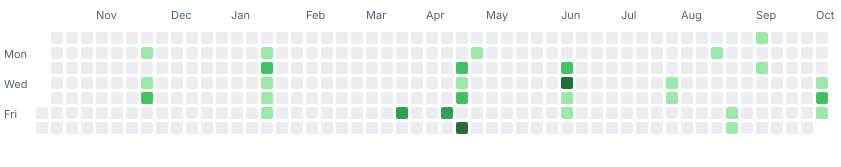
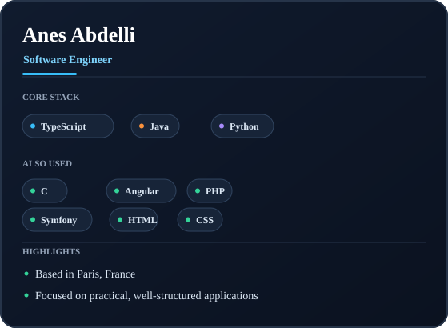

<h1 align="center">Anes Abdelli</h1>

<p align="center">
  Software engineer building practical, well-structured applications.
</p>

<p align="center">
  <a href="https://github.com/anesabdelli">GitHub</a>
  ·
  <a href="https://github.com/anesabdelli?tab=repositories">Repositories</a>
  ·
  <a href="https://github.com/anesabdelli?tab=followers">Followers</a>
</p>

<p align="center">
  
  
  
</p>

## About

- Based in Paris, France.
- Software engineer working primarily with TypeScript, Java, and Python.
- Also experienced with C, Angular, PHP, Symfony, HTML, and CSS.

## Contributions

<p align="center">
  
</p>

The heatmap is fetched from GitHub's public contributions page hourly. The workflow uses the repository's built-in `GITHUB_TOKEN` to commit and push only when contribution data changes; each run records its fetch time in the Actions summary. You can also run **Update profile contribution art** manually from the Actions tab. To activate it, push the workflow to the repository's default branch and ensure GitHub Actions is enabled. GitHub may delay scheduled runs, so this is periodic rather than an instant real-time feed.

## About me

<table>
  <tr>
    <td align="center" valign="middle">
      
    </td>
    <td align="center" valign="middle">
      
    </td>
  </tr>
</table>

## Languages and tools

<p align="center">
  
</p>

My core stack is **TypeScript, Java, and Python**. I have also worked with **C, Angular, PHP, Symfony, HTML, and CSS**.

## Live GitHub stats

These cards request profile statistics from their respective services when rendered; the linked SVGs are not generated by the contribution workflow.

<p align="center">
  
</p>

<p align="center">
  
</p>

<p align="center">
  
</p>

<p align="center">
  
  
</p>

---

The portrait, profile card, and contribution heatmap are generated by the scripts in [`scripts/`](./scripts/). The live stats above are API-backed embeds from their respective services.

### Regenerate locally

```powershell
python -m venv .venv
.\.venv\Scripts\Activate.ps1
pip install -r scripts/requirements.txt
python scripts/prep_photo.py
python scripts/make_ascii_svg.py
python scripts/make_info_card.py
python scripts/fetch_contributions.py anesabdelli
python scripts/render_heatmap_svg.py
```

Replace `data/profile-photo.jpg` with your own portrait to use a different photo. Add `--remove-background` to `prep_photo.py` to run the optional `rembg` cutout step.
